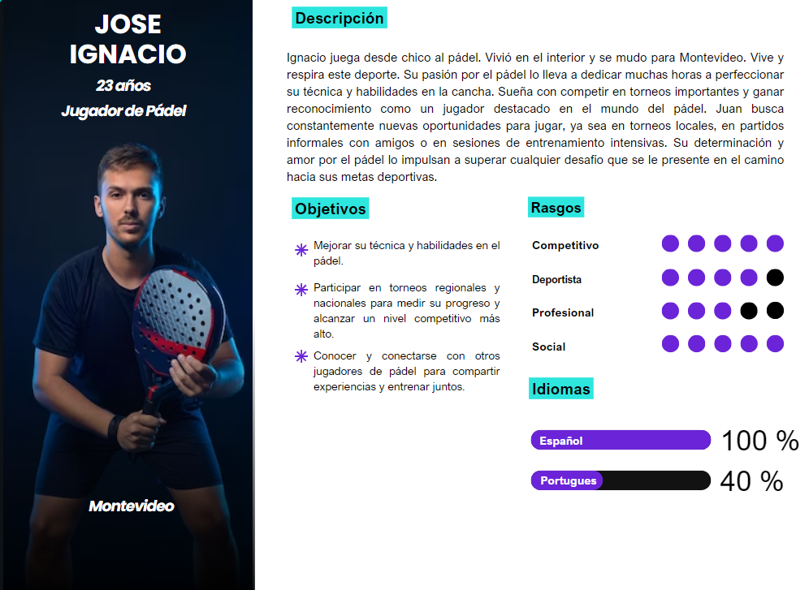
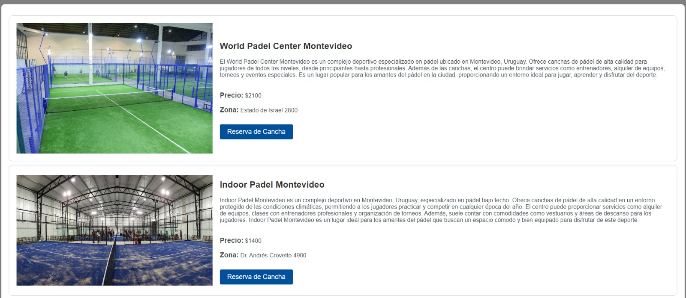
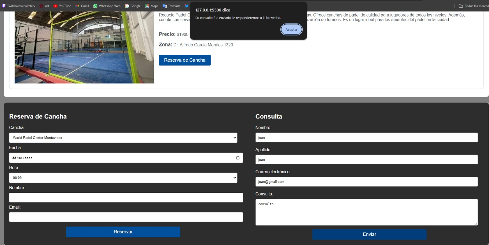
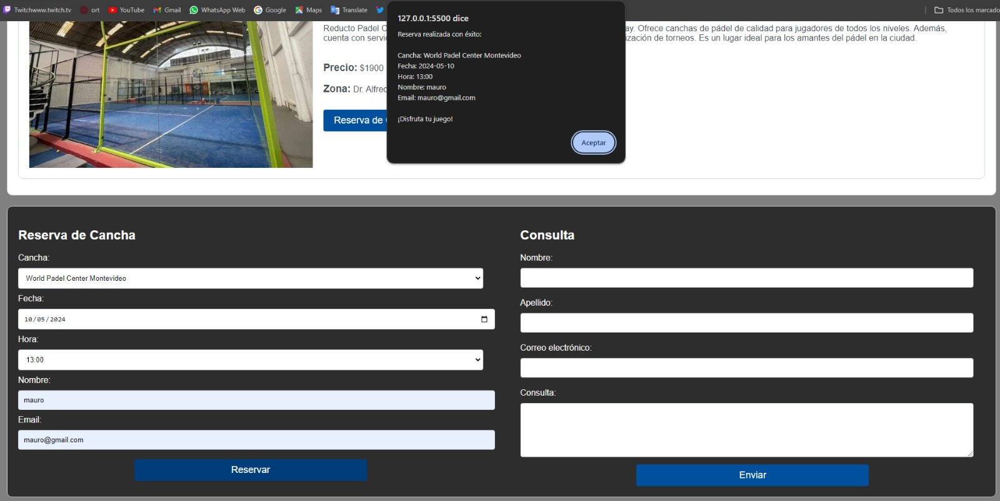
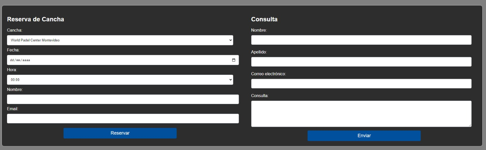

# Práctica de interfaz de usuario

# REPOSITORIO
Para la coordinación y gestión del código fuente, nuestro equipo empleó un repositorio en GitHub, que cada uno de nosotros clonó localmente en su máquina. A lo largo del proyecto, implementamos varios comandos de Git que habíamos aprendido en clase, incluyendo las siguientes: 
+ git clone
+ git init
+ git add .
+ git commit -m "texto" 
+ git branch [nombre de la rama]
+ git push
+ git checkout [nombre de la rama]
+ git merge [nombre del archivo]

para manejar nuestras actualizaciones y colaboración de manera eficiente.

Para la organización y estructuración del proyecto, se elaboró un archivo README.md que detalla y documenta exhaustivamente el proceso seguido. Dentro de la misma carpeta, se agregaron las imagenes utilizadas.
Imagenes: 
+ User Persona: Dueño
+ User Persona: Jugador
+ User Persona: Modelado Conceptual del sistema a implementar. 

# VERSIONADO

Optamos por una estrategia de ramificación que involucra la creación de cuatro ramas principales, correspondientes a cada uno de los integrantes del equipo. Esto permitió que cada miembro trabajara de manera independiente sin interferir con el progreso de los demás, utilizando los comandos git branch y git merge para gestionar las integraciones de sus contribuciones.
La rama main se reservó exclusivamente para los cambios completamente finalizados y revisados, asegurando que todo lo que se merge a esta rama esté listo para producción y no requiera modificaciones adicionales. Esta metodología no solo mejoró la organización del trabajo sino que también maximizó la eficiencia al permitir el desarrollo en paralelo sin comprometer la integridad del código en la rama principal.

# ELICITACIÓN

# Entrevista

Basándose en la entrevista, se pueden identificar varias problemáticas:

### Problemáticas:

1. **Ineficiencia en la coordinación de reservas:** El propietario menciona dificultades para gestionar los horarios y las reservas de los clientes de manera eficiente utilizando un sistema manual. Esto puede llevar a conflictos de horarios y a una experiencia deficiente para los clientes.

2. **Comunicación limitada con los clientes:** Debido a la falta de un sistema automatizado, la comunicación con los clientes sobre las reservas y los horarios puede ser limitada y poco clara, lo que puede resultar en malentendidos y problemas de satisfacción del cliente.

### Problemática a Resolver:

La problemática principal a resolver es la ineficiencia en la gestión de reservas y horarios. Esto afecta directamente la experiencia del cliente y la eficiencia operativa del negocio. 

### Solución Propuesta:

La solución propuesta para abordar estas problemáticas sería implementar un sistema de reserva en línea. Este sistema debería tener las siguientes características:

1. **Gestión automatizada de reservas:** Permitir a los clientes seleccionar una cancha disponible de una lista y reservar para una fecha y hora específicas de manera rápida y sencilla.

2. **Calendario de disponibilidad en tiempo real:** Mostrar la disponibilidad de las canchas en tiempo real para evitar conflictos de horarios y garantizar una asignación eficiente de los recursos.

3. **Notificaciones automáticas:** Enviar recordatorios automáticos de reserva a los clientes para reducir las ausencias y mejorar la comunicación.

4. **Interfaz intuitiva y fácil de usar:** Proporcionar una interfaz amigable tanto para el propietario como para los clientes, lo que facilite la gestión de reservas y la navegación por el sistema.

5. **Soporte para consultas y problemas:** Incluir un sistema de soporte para que los clientes puedan comunicarse fácilmente con el negocio en caso de problemas o consultas relacionadas con las reservas.

Implementar esta solución no solo mejorará la eficiencia en la gestión de reservas y horarios, sino que también mejorará la experiencia del cliente al proporcionar una forma conveniente y transparente de reservar canchas de pádel.

# Modelado de usuarios del sistema
## User Persona: Dueño

## User Persona: Jugador

# Modelo Conceptual del Problema

# ESPECIFICACIÓN
# Requerimientos funcionales (RF):
#### + RF1 Título: 
Reserva de Cancha. Descripción: Los usuarios pueden seleccionar una cancha disponible de la lista y reservarla para una fecha y hora específicas. Actor: Cliente. Prioridad: Alta.
#### + RF2 Título: 
Verificación de Disponibilidad. Descripción: El sistema debe verificar la disponibilidad de la cancha seleccionada para la fecha y hora solicitadas antes de confirmar la reserva. Actor: Sistema. Prioridad: Alta.
#### + RF3 Título: 
Registro de Reservas. Descripción: El sistema debe almacenar la información de las reservas realizadas, incluyendo la cancha, fecha, hora, nombre y correo electrónico del cliente. Actor: Sistema. Prioridad: Alta.
#### + RF4 Título: 
Prevención de Reservas Duplicadas. Descripción: El sistema debe evitar que se realicen reservas para una misma cancha en la misma fecha y hora, mostrando una alerta al usuario en caso de intento de duplicación. Actor: Sistema. Prioridad: Media.
#### + RF5 Título: 
Notificación de Confirmación. Descripción: Después de realizar una reserva exitosa, el sistema debe enviar una notificación al correo electrónico proporcionado por el cliente confirmando los detalles de la reserva. Actor: Sistema. Prioridad: Alta.
#### + RF7 Título: 
Visualización de Historial de Reservas. Descripción: Los usuarios pueden acceder a un historial de sus reservas anteriores, visualizando la información detallada de cada reserva realizada. Actor: Cliente. Prioridad: Baja.
#### + RF8 Título: 
Consulta de Información de Canchas. Descripción: Los usuarios pueden acceder a la información detallada de las canchas disponibles en la lista. Pueden examinar detalles como descripciones, precios, ubicaciones y disponibilidad de las canchas. Actor: Cliente. Prioridad: Alta.
#### + RF9 Título: 
Registro de Pagos en la Cancha Descripción: El sistema debe permitir que el personal de la cancha registre los pagos realizados por los clientes directamente en el lugar, durante el proceso de reserva de la cancha. Esto incluye registrar el monto pagado, el método de pago utilizado (por ejemplo, efectivo, tarjeta de crédito), la fecha y hora del pago, así como la referencia de la reserva asociada. Este registro de pagos garantizará un seguimiento claro de los pagos realizados por los clientes en relación con sus reservas de canchas.Actor: Personal de la Cancha.Prioridad: Alta.
#### + RF10:Título: 
Sistema de Consultas Descripción: El sistema debe proporcionar una funcionalidad de consulta que permita a los usuarios enviar preguntas o solicitar información adicional sobre el servicio de reserva de canchas.Actor: Cliente. Prioridad: Media.

# Requerimientos no funcionales (RNF)
#### - RNF1 Rendimiento: 
El sistema debe proporcionar tiempos de carga y respuesta rápidos, con un máximo de 10 segundos para cargar una página y procesar una reserva. Debe manejar un alto volumen de solicitudes simultáneas sin degradación del rendimiento. Prioridad: Alta.
#### - RNF2 Escalabilidad: 
El sistema debe ser escalable para soportar un aumento en el número de usuarios y reservas sin afectar su rendimiento. Debe poder adaptarse fácilmente a nuevas canchas y funcionalidades adicionales. Prioridad: Alta.
#### - RNF3 Disponibilidad: 
El sistema debe estar disponible las 24 horas del día, los 7 días de la semana, con un tiempo de inactividad planificado mínimo para mantenimiento. Se debe garantizar una disponibilidad del 99.9%. Prioridad: Alta.
#### - RNF4 Seguridad: 
El sistema debe implementar medidas de seguridad robustas para proteger la información del usuario y las transacciones, incluyendo encriptación de datos, autenticación segura y protección contra ataques cibernéticos. Debe cumplir con estándares de seguridad de la industria. Prioridad: Alta.
#### - RNF5 Fiabilidad: 
El sistema debe ser confiable y resistente a fallas, con mecanismos de respaldo y recuperación en caso de interrupciones inesperadas. Debe garantizar la integridad y disponibilidad de los datos en todo momento. Prioridad: Media.
#### - RNF6 Usabilidad: 
La interfaz de usuario debe ser intuitiva y fácil de usar, con un diseño limpio y organizado que permita a los usuarios realizar reservas de manera rápida y sin confusiones. Debe ser accesible para usuarios de todas las edades y niveles de experiencia. Prioridad: Media.
#### - RNF7 Cumplimiento Legal y Normativo: 
El sistema debe cumplir con todas las leyes y regulaciones relacionadas con la privacidad de datos, protección del consumidor y cualquier otro requisito legal aplicable en el ámbito de reservas deportivas en línea. Debe garantizar la privacidad y seguridad de la información del cliente. Prioridad: Alta.
#### - RNF8: ID: RNF8 Compatibilidad: 
El sistema debe ser compatible con una variedad de dispositivos y navegadores web populares, asegurando una experiencia consistente para todos los usuarios independientemente del dispositivo que utilicen. Prioridad: Media.
#### - RNF9 Testeabilidad: 
El sistema debe ser fácilmente testeable para garantizar su correcto funcionamiento y conformidad con los requisitos establecidos. Se deben realizar pruebas exhaustivas de todas las funcionalidades antes de su implementación en producción. Prioridad: Media.
#### - RNF10 Mantenibilidad: 
El sistema debe ser fácil de mantener y actualizar, permitiendo la incorporación de nuevas funcionalidades y la corrección de errores de manera eficiente y sin afectar su funcionamiento. Debe seguir buenas prácticas de desarrollo de software y modularidad. Prioridad: Media.
#### - RNF11 Integración: 
El sistema debe ser capaz de integrarse con sistemas de pago en línea para procesar transacciones de reserva de manera segura y eficiente. Debe ser compatible con múltiples pasarelas de pago y proveedores de servicios de pago. Prioridad: Alta.

# CASOS DE USO
#### Bocetos UI 

### Titulo: Reserva de Cancha

|Actor: Cliente |
| ------------- | ------------- |
Acción de los actor Respuesta del sistema
|1. El cliente accede a la sección de reserva de canchas en la aplicación. |2. La aplicación muestra los días disponibles para la cancha seleccionada.|
|3. El cliente selecciona una cancha de la lista. |4. La aplicación muestra los horarios disponibles para el día seleccionado.|
|5. El cliente elige un horario disponible. |6. La aplicación muestra los detalles de la reserva y las instrucciones para llegar a la cancha|
|7. El cliente confirma la reserva.|
Cursos alternativos:
7.1 Si el horario seleccionado no tiene cupo, la app muestra un mensaje de error y no habilita la confirmación. 

Referencias a Requerimientos:
- Reserva (RF1)
-Verificación de Disponibilidad(RF2)
-  Registro de Reservas (RF3)
-  Notificación de Confirmación(RF5)

# VALIDACIÓN Y VERIFICACIÓN
Validación con Usuarios
Se llevó a cabo una validación con usuarios potenciales de la aplicación de reserva de canchas de pádel:

#### Usuario 1: Juan Pérez

Edad: 35 años
Experiencia: Jugador de pádel aficionado durante 3 años
Comentarios positivos:
Encontró el proceso de reserva intuitivo y fácil de usar.
Apreció la visualización clara de los horarios disponibles.
Le gustó la función de confirmación de reserva con detalles y direcciones de la cancha.

#### Usuario 2: María López

Edad: 28 años
Experiencia: Principiante en pádel
Comentarios positivos:
Encontró útil la lista de canchas con información detallada.

Validación de Prototipo
Ambos usuarios expresaron satisfacción con la experiencia de reserva de canchas de pádel. Sin embargo, sugirieron las siguientes mejoras:

Incluir un tutorial breve para nuevos usuarios sobre cómo utilizar la aplicación.
Agregar la opción de guardar canchas favoritas para un acceso rápido en futuras reservas.
Mejorar la visualización de la disponibilidad de horarios en días cercanos al actual.
Estas sugerencias proporcionan valiosa retroalimentación para mejorar la usabilidad y la satisfacción del usuario.

# REFLEXIÓN

# Investigación

# Recursos adicionales
- [Documentación de HTML](https://www.w3.org/html/)
- [Documentación de Bootstrap](https://getbootstrap.com/docs/5.3/getting-started/introduction/)
- [WAVE Evaluation Tool](https://chromewebstore.google.com/detail/wave-evaluation-tool/jbbplnpkjmmeebjpijfedlgcdilocofh)
