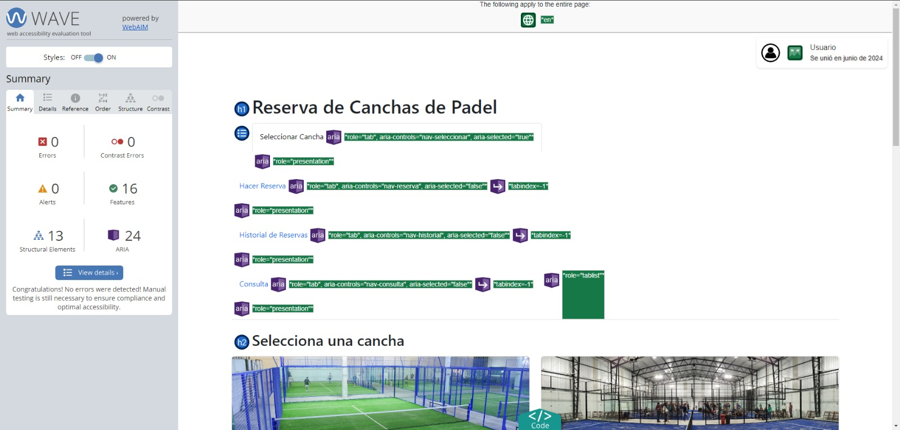

#Informe entrega 2

## Construcción del Proyecto

Durante la fase de construcción de nuestro proyecto web, hemos empleado una combinación efectiva de tecnologías y herramientas para garantizar la funcionalidad y la calidad del producto final. A continuación, detallamos cómo hemos utilizado estos elementos clave en nuestra implementación:

## HTML

HTML ha servido como el lenguaje fundamental para estructurar las diversas páginas de nuestro sitio web. Utilizamos etiquetas semánticas y accesibles para organizar el contenido de manera lógica y fácil de entender para los usuarios y los motores de búsqueda. Además, hemos implementado formularios HTML para la captura de datos de reserva de canchas, asegurando que la entrada de datos sea clara y validada tanto en el lado del cliente como en el servidor.

## CSS y Bootstrap

Para el diseño visual y la presentación estilizada de nuestro sitio web, hemos utilizado CSS y el framework Bootstrap. CSS nos ha permitido personalizar el aspecto de nuestros elementos HTML, asegurando una interfaz de usuario atractiva y coherente. Bootstrap, por su parte, nos ha facilitado la creación de un diseño responsivo y adaptable, optimizando la experiencia del usuario en una variedad de dispositivos y tamaños de pantalla.

## Flowbite

Flowbite, una biblioteca de componentes para Tailwind CSS, ha sido instrumental en la implementación de componentes de interfaz de usuario como avatares, botones y menús desplegables. En particular, hemos utilizado el componente de Avatar de Flowbite para mostrar imágenes de perfil de usuario de manera elegante y consistente.

## JavaScript

JavaScript ha sido esencial para la interactividad dinámica de nuestro sitio web. Lo hemos utilizado para validar formularios, gestionar eventos del usuario, como clics y envíos de formularios, y actualizar dinámicamente el contenido de la página sin necesidad de recargarla. Esto ha mejorado significativamente la usabilidad y la eficiencia de nuestra aplicación web.

## Accesibilidad con Wave

Para garantizar que nuestra aplicación web sea accesible para todos los usuarios, hemos integrado la herramienta Wave. Con Wave, hemos realizado auditorías automáticas de accesibilidad que nos han permitido identificar y corregir problemas como la falta de atributos "alt" en imágenes, el uso adecuado de etiquetas semánticas y la navegación mejorada con teclado. Esto asegura que nuestra aplicación cumpla con los estándares de accesibilidad web y sea usable por una amplia gama de usuarios.

## Interfaz de Usuario

La interfaz de usuario de nuestro proyecto se ha diseñado siguiendo principios de usabilidad y accesibilidad. Hemos adoptado un enfoque minimalista para mantener la simplicidad y la claridad en la navegación. La estructura de una sola página (single-page application) nos ha permitido presentar la información de manera fluida y mantener una experiencia de usuario intuitiva.

## Codificación

Durante la fase de codificación, hemos utilizado herramientas y prácticas que han mejorado la calidad y la eficiencia de nuestro código:

- **Entorno de Desarrollo**: Hemos trabajado con Visual Studio Code como nuestro entorno de desarrollo principal debido a su interfaz amigable y sus potentes funcionalidades, que han aumentado nuestra productividad.
- **Control de Versiones con Git**: Git ha sido fundamental para gestionar versiones y colaborar eficientemente en el desarrollo del proyecto. Nos ha permitido mantener un registro detallado de los cambios y facilitar la integración de nuevas características y correcciones de errores.
- **Desarrollo Frontend**: Hemos combinado HTML, JavaScript y CSS para desarrollar un frontend robusto y atractivo. La inclusión de Bootstrap ha sido especialmente beneficiosa para mantener un diseño coherente y responsivo en todo el sitio.

## Test Unitario

Para garantizar la funcionalidad correcta de nuestro código, hemos implementado pruebas unitarias utilizando Jest, un framework de pruebas para JavaScript. Estas pruebas han cubierto diversas áreas críticas de nuestro proyecto:

- **Validación de Formularios**: Verificamos que la validación de datos en nuestros formularios se realice correctamente, asegurando que solo se acepten datos válidos según los criterios establecidos.
- **Interactividad de la Interfaz**: Probamos la interacción de los usuarios con elementos dinámicos como botones y ventanas emergentes, asegurando que las acciones del usuario se manejen correctamente sin errores inesperados.
- **Integración de Componentes**: Confirmamos que los componentes y módulos de nuestro proyecto funcionen de manera conjunta sin conflictos ni problemas de integración.

## Reflexión y Próximos Pasos

En esta fase del proyecto, hemos logrado avances significativos en la implementación de la funcionalidad principal y la creación de una interfaz de usuario atractiva y accesible. Sin embargo, reconocemos la necesidad de seguir mejorando y ampliando nuestras funcionalidades. Los próximos pasos incluirán:

- Implementación de la persistencia de datos para almacenar y recuperar reservas de manera segura.
- Mejora continua de la interfaz de usuario y la experiencia del usuario basada en retroalimentación y pruebas de usuario.
- Ampliación de las pruebas unitarias para cubrir más escenarios y asegurar la estabilidad a largo plazo del proyecto.

### Reflexión individual (Mauro Orona)
Durante este proyecto, he mejorado mucho en el uso de HTML, CSS y Bootstrap para crear una estructura clara y un diseño atractivo y responsivo. JavaScript ha sido clave para añadir interactividad y validar formularios, lo que ha sido un desafío interesante. Wave me ha ayudado a asegurar que nuestro sitio sea accesible para todos. Trabajar con Visual Studio Code y Git ha mejorado mi productividad y colaboración en equipo. Las pruebas unitarias con Jest han sido fundamentales para garantizar la calidad del código. En resumen, este proyecto me ha ayudado a crecer como desarrollador web.

### Reflexión individual (Joaquin Kalichman)
Participar en este proyecto me ha permitido aplicar y expandir mis conocimientos en desarrollo web. Aprendí la importancia de un marcado semántico con HTML y cómo CSS y Bootstrap pueden mejorar el diseño y la responsividad. JavaScript fue esencial para añadir interactividad y validar formularios. Wave me ayudó a asegurar que el sitio sea accesible. Utilizar Visual Studio Code y Git facilitó la colaboración y la gestión de versiones. Las pruebas unitarias con Jest me enseñaron a asegurar la funcionalidad correcta desde el principio. Este proyecto ha sido una experiencia valiosa que ha reforzado mis habilidades.

### Reflexión individual (Juan Cortabarria)
Este proyecto me ha ayudado a crecer en mis habilidades de desarrollo web. Aprendí a usar HTML para estructurar páginas de manera clara y Bootstrap para un diseño atractivo y responsivo. JavaScript fue fundamental para añadir interactividad y validar formularios. Wave fue crucial para garantizar la accesibilidad. Las pruebas unitarias con Jest aseguraron la calidad del código. En general, este proyecto me ha preparado mejor para futuros desafíos en el desarrollo de paginas web.
